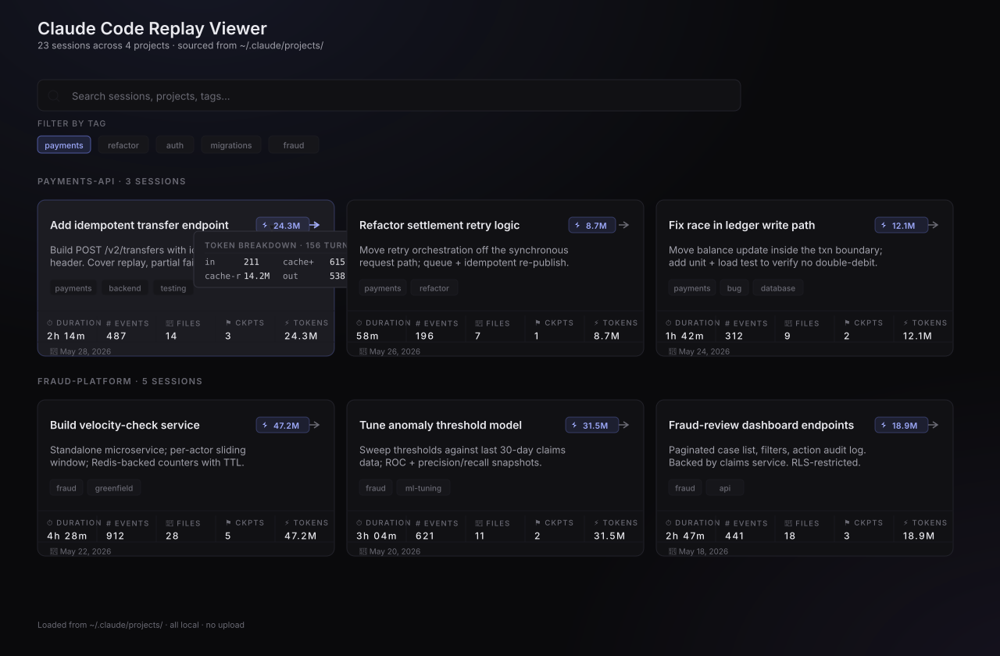
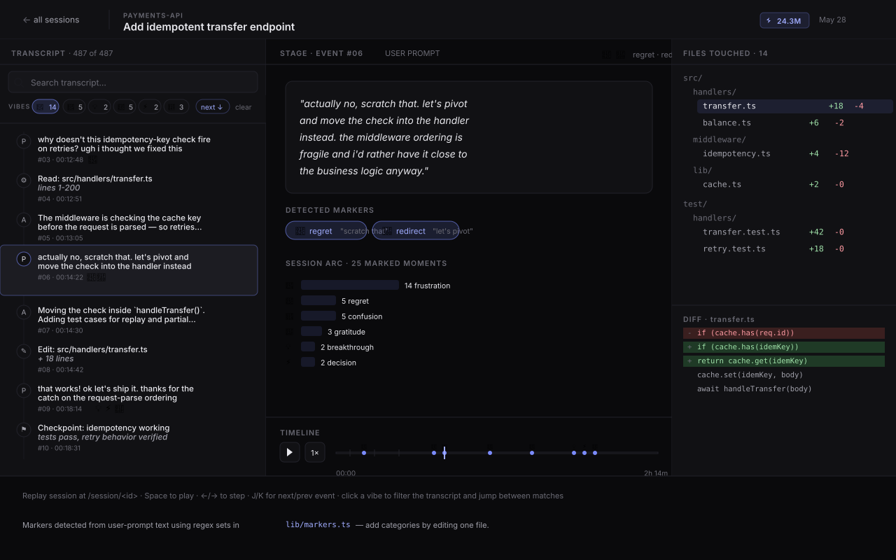
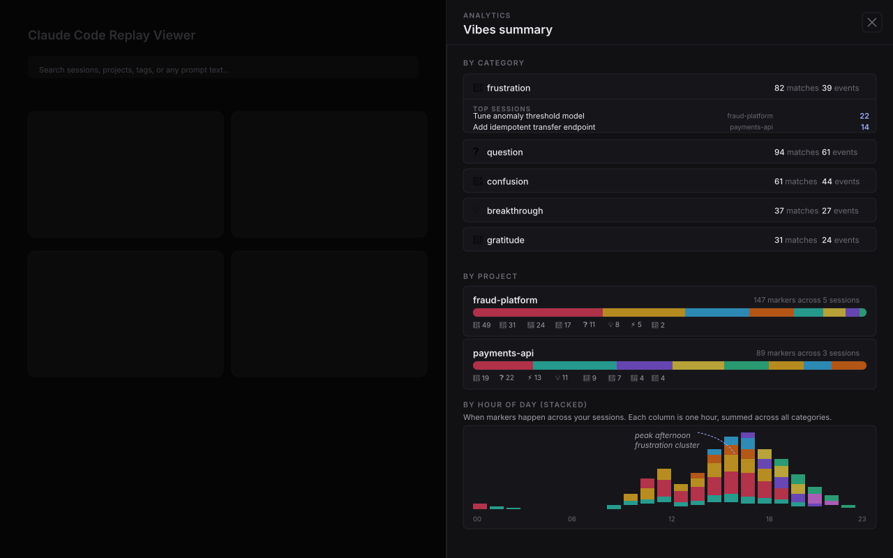

# Claude Code Replay Viewer

Replay your Claude Code sessions as an interactive timeline.

Drop the viewer at your local machine, point it at `~/.claude/projects/`, and every Claude Code session you've ever run becomes a navigable artifact — transcript, tool calls, file changes, token consumption, the whole shape of how the work actually happened.

Built for product folks and engineers who want to understand (or share) *how* a piece of work got made — not just what shipped.



*The picker. Sessions grouped by project, each card showing the token chip at upper-right and the vibes (sentiment markers) detected in user-prompt text. The "Vibes" facet row lets you filter sessions by emotional shape — find the frustrated ones, the breakthrough ones, the regret-heavy ones. Mock data shown — your real sessions populate from `~/.claude/projects/`.*



*The detail view. Transcript on the left with per-event marker badges. The Vibes filter row at the top lets you narrow the transcript to specific categories and jump between matches. Stage panel in the center shows the current event with detected markers called out. The timeline scrubber surfaces marker positions across the whole session so you can see the emotional shape at a glance.*



*Vibes summary drawer. Per-category aggregates with top sessions, per-project distribution showing which projects accumulate which categories, and a 24-hour stacked histogram surfacing time-of-day patterns ("most frustration in the afternoon" or "breakthroughs cluster in early evening").*

---

## What you get

- **Session picker** — every JSONL session under `~/.claude/projects/` grouped by project, with at-a-glance stats: duration, events, files touched, checkpoints, and **token consumption** (input · cache creation · cache read · output, hover for the breakdown).
- **Transcript panel** — full user prompts, assistant responses, and tool calls in causal order.
- **Stage panel** — current event content, snapshots, and shipped-state checkpoint.
- **File tree + diff viewer** — see which files changed, at which moment, with before/after.
- **Timeline scrubber** — play, pause, speed control, step-by-step navigation.
- **Tag-facet filtering** — clickable chips to "pick through" the collection.
- **Token consumption visibility** — surface what each session actually cost in tokens, broken into raw input, cache creation, cache read, and output.
- **Vibes (sentiment markers)** — scan your user prompts for cursing, confusion, breakthroughs, celebration, and regret. Five categories, each filterable. Find the frustrated sessions, find the satisfying ones.

The whole viewer is read-only and local-first — your session data never leaves your machine.

---

## Why

A Claude Code session is a rich artifact: prompts, decisions, edits, tool calls, files touched, output. Most of that detail evaporates the moment the session ends. This viewer makes it inspectable.

Use it for:

- **Sharing the process.** Send a colleague a link to a specific session moment to walk through what changed and why.
- **Reviewing your own work.** Replay your last week's sessions to spot patterns — what you redo, where you get stuck, what produces the best code.
- **Auditing AI-assisted development.** In regulated contexts, the prompt+reasoning trail is part of the audit record. The viewer makes that trail navigable.
- **Token accounting.** See per-session token totals at a glance — useful for budget planning, finding the most expensive sessions, or understanding where cache hits help.

---

## Quick start

```bash
# Clone, install, run
git clone https://github.com/cjohnkim/claude-replay-viewer.git
cd claude-replay-viewer
npm install
npm run dev
# → http://localhost:3033
```

The viewer reads from `~/.claude/projects/` automatically — no configuration required. Every JSONL session there appears in the picker, grouped by project.

Want it on a different port? Edit `package.json` (the dev/start scripts hardcode `-p 3033`).

---

## Deploy your own

[](https://vercel.com/new/clone?repository-url=https%3A%2F%2Fgithub.com%2Fcjohnkim%2Fclaude-replay-viewer)

Note: this deploys the *viewer code*, not your session data. Vercel can't read `~/.claude/projects/` on your local machine. A deployed instance is useful for showing the codebase or for running against a mock-session test set, not for serving your real sessions.

For inspecting your own sessions, run `npm run dev` on the machine where the sessions live and view at `localhost:3033`.

---

## Layout

| Panel | What's there |
|---|---|
| **Left** | Session transcript with search + filters |
| **Center** | Stage panel — current event content, snapshots, shipped-state checkpoint |
| **Right** | File tree (at the selected moment) over a diff viewer |
| **Bottom** | Timeline scrubber with play/pause, speed control, per-event ticks |

## Keyboard

| Key | Action |
|---|---|
| Space | Play / pause |
| ← / → | Step backward / forward |
| J / K | Next / previous meaningful event |
| Home / End | First / last event |

---

## Token consumption

Every session card shows total tokens consumed in the upper-right, in a gold chip:

```
⚡ 28.1M
```

Hover (or check the tokens cell in the stats grid) to see the breakdown:

```
in: 211 · cache+: 615.6K · cache-r: 14.2M · out: 538.2K · 156 turns
```

- **in** — raw uncached input tokens (full price)
- **cache+** — cache creation input tokens (one-time write)
- **cache-r** — cache read input tokens (cheap reads)
- **out** — output tokens generated
- **turns** — number of assistant turns that contributed usage

A session that looks expensive on totals often turns out to be mostly cache reads, which bill at ~10× lower than raw input. The breakdown surfaces the real cost shape.

---

## Vibes — sentiment markers

The viewer scans your *user-prompt* text (not Claude's responses) for eight categories of marker, displays them on the picker and inside each session's transcript, and lets you filter by them:

| Marker | What it catches |
|---|---|
| 😤 **frustration** | cursing, "doesn't work", "this is broken", "why doesn't", "i hate" |
| 🤔 **confusion** | "wait, what", "i don't understand", "huh?", "hmm", "explain" |
| 💡 **breakthrough** | "got it", "finally", "that works", "nailed it", "there we go" |
| 🎉 **celebration** | "amazing", "beautiful", "love it", "perfect", "awesome" |
| 😬 **regret** | "actually no", "scratch that", "wait wrong", "my bad", "let me revert" |
| ⚡ **decision** | "let's go with", "ship it", "going with", "the call is", "let's commit" |
| 🔀 **redirect** | "let's pivot", "different approach", "actually let's", "new direction" |
| 🙏 **gratitude** | "thanks", "appreciate", "nice catch", "good call", "well done" |
| ❓ **question** | actionable inquiry — "how do I", "should we", "what's the best way", "can you explain" (distinct from confusion, which is reactive) |

All detection is local — the regex sets live in [`lib/markers.ts`](./lib/markers.ts). Conservative by design: word-bounded curses, specific phrases for the non-curse categories. Sarcasm ("great", "wonderful") is deliberately not caught — too ambiguous.

Each session card surfaces matched categories as small badges. Hover for the detected sample phrases. The "Vibes" facet row at the top of the picker lets you filter to sessions where a given category fired. The search bar also matches against detected marker text — so typing `wtf` or `got it` finds the sessions where you said those things.

Inside a session, the transcript shows the same marker badges next to each event that triggered them. A Vibes filter row above the transcript lets you narrow to specific categories and jump between matches — useful in long sessions where you want to skip straight to the frustration moments or the breakthrough turns.

The **timeline scrubber** at the bottom of the session view surfaces marker positions as emoji dots distributed along the track — so you can see the emotional shape of the whole session at a glance and click any dot to jump straight to that moment.

The **Vibes summary** button on the picker opens an analytics drawer covering the whole collection:

- **By category** — total counts per marker plus the top 3 sessions in each, click-through to the session
- **By project** — stacked horizontal bars showing which projects accumulate which categories
- **By hour of day** — 24-bucket stacked histogram surfacing time-of-day patterns ("most frustration in the afternoon", "breakthroughs cluster in early evening")

Two uses for this:

- **Inspect your own work.** Find the sessions where you got the most stuck. Find the ones where you broke through. Pattern-match across them — what conditions produced the breakthroughs, and what produced the slog?
- **Share the process honestly.** When walking a colleague through a piece of work, show them the frustration moments alongside the wins. The real shape of building software is in the friction, not just the merged PRs.

---

## How it works

The viewer reads `~/.claude/projects/<encoded-cwd>/<session-uuid>.jsonl` files directly. Each line is a Claude Code event; the ingest layer (`lib/ingest.ts`) maps user / assistant / tool_use blocks into the viewer's `Session` shape. Aggregate token usage is computed from each assistant turn's `message.usage` field.

Pages use `force-dynamic` SSR — content comes from your home dir per request. No build step. No cache. No data export.

If a session predates Claude Code's token-usage logging (early versions), it'll show `—` instead of a token count. New sessions log usage by default.

---

## Architecture

Stack:

- **Next.js 14** (App Router)
- **React 18** + **TypeScript**
- **Tailwind CSS** for styling
- **Lucide React** for icons

File map:

```
app/                          # Next.js App Router pages
  page.tsx                    # Session picker
  session/[id]/page.tsx       # Session viewer
components/
  session-picker.tsx          # Picker UI + cards (token chip lives here)
  replay-viewer.tsx           # Detail view orchestrator
  transcript-panel.tsx        # Transcript timeline
  stage-panel.tsx             # Stage view
  file-tree.tsx               # File tree
  diff-viewer.tsx             # Diff display
  timeline-scrubber.tsx       # Bottom scrubber
  snapshot-viewer.tsx         # Snapshot display
  checkpoint-panel.tsx        # Checkpoint UI
lib/
  ingest.ts                   # JSONL → Session adapter (token aggregation here)
  sessions/                   # Mock sessions (vestigial)
  types.ts                    # Type definitions
  utils.ts                    # Shared utilities
```

`lib/ingest.ts` is the single point of contact with your home directory. Everything else operates on the `Session` shape.

---

## Privacy

- All data stays local. The viewer reads files from `~/.claude/projects/` and renders them in your browser. Nothing is uploaded.
- The Vercel "deploy" option ships the *viewer code*, not your session data. A hosted instance can't reach your local `~/.claude/projects/` directory.

---

## Contributing

Issues and PRs welcome. Useful directions:

- **Adapters for other formats** — the viewer is shaped around Claude Code's JSONL but the ingest layer is replaceable; an adapter for other AI dev tools' logs would be a clean addition.
- **Better diff reconstruction** — `fileChanges` is currently `{}` for real sessions because we don't yet reconstruct per-file diffs from Edit/Write tool inputs. ~150 LOC, fits in ingest.
- **Dollar-cost display** — multiply token counts by Sonnet/Opus pricing for a `~$X.XX` cell alongside the tokens cell.
- **Export to PDF/HTML** — static export of a session for sharing without a server.
- **Cache reads of `loadAllSessions`** — currently the picker reparses all JSONLs on every page load. A memoize-by-mtime cache layer is easy and would scale linearly.

## License

MIT — see [LICENSE](./LICENSE).
